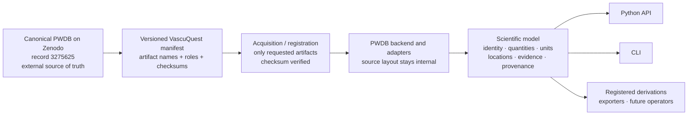
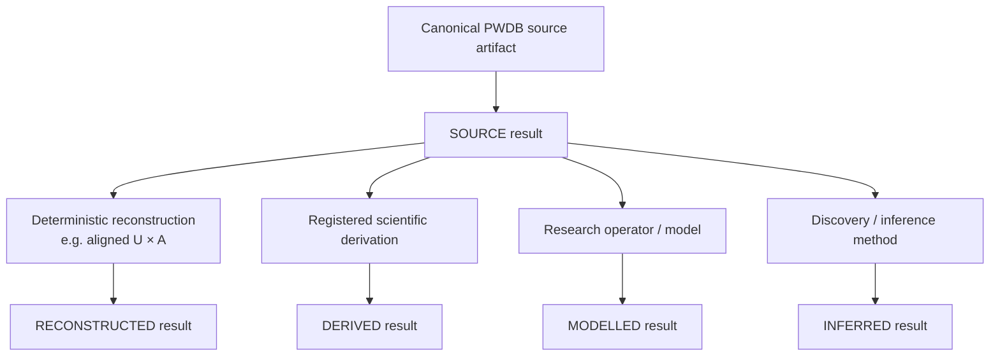

# VascuQuest

**Scientific exploration and discovery for virtual vascular populations.**

[](https://github.com/KNOWDYN/VascuQuest/actions/workflows/ci.yml)
[](https://www.python.org/)
[](LICENSE)
[](pyproject.toml)
[](https://doi.org/10.5281/zenodo.3275625)

VascuQuest is a Python package and command-line interface for **research-grade access to the Pulse Wave DataBase (PWDB)**, using the canonical Zenodo record [`3275625`](https://zenodo.org/records/3275625) as its upstream source of truth.

It does **not** replace, re-host, or silently modify PWDB. Instead, it provides a verified research layer around the original dataset: explicit dataset identity, selective artifact acquisition, checksum verification, stable scientific quantity and location semantics, evidence classes, provenance, reproducible exports, and one shared implementation path for Python and the CLI.

> **Current status:** VascuQuest is pre-release (`0.1.0.dev0`). Its validated production scope includes scalar subject quantities, source-supported geometry, common-site waveforms, one validated flow-rate reconstruction, JSON/CSV export, provenance-aware reproduction, plugin inspection, and matching Python/CLI application flows. Dense path-resolved waveforms have passed the real-source ingestion gate but are **not yet a shipped public capability**.

## At a glance

| | |
|---|---|
| **Canonical upstream dataset** | Pulse Wave DataBase (PWDB), Zenodo record `3275625` |
| **Dataset DOI** | [`10.5281/zenodo.3275625`](https://doi.org/10.5281/zenodo.3275625) |
| **Virtual population** | 4,374 simulation instances; a VascuQuest `VirtualSubject` is **not a patient** |
| **Package role** | Verified scientific access, semantics, provenance, derivation, export, and reproducibility layer |
| **Primary interfaces** | Python API and `vascuquest` CLI |
| **Core source formats used in production** | CSV tables, ZIP geometry, common-site CSV waveform archive |
| **Current path-data status** | Canonical MAT/HDF5 ingestion validated; production path reader still pending |
| **Python support** | 3.11, 3.12, 3.13, 3.14 |
| **Software licence** | Apache-2.0 |

## What problem does VascuQuest solve?

PWDB is a rich virtual-population research dataset, but the canonical record is a collection of heterogeneous artifacts rather than a single application-level research interface. It includes subject/model tables, geometry, common-site pulse waves in multiple representations, unified MATLAB data, and multi-gigabyte path-resolved files.

VascuQuest makes that source usable as a **scientific research substrate** without requiring every researcher to build their own file readers, artifact checks, naming conventions, unit handling, provenance rules, or command-line tooling.

The package is designed to answer questions such as:

- Which virtual subjects satisfy a model or haemodynamic condition?
- Which canonical quantities are available for a subject or cohort?
- What source waveform is available at a named vascular measurement site?
- What geometry is associated with a virtual subject?
- Was a result read directly from PWDB, reconstructed from source quantities, derived by a method, inferred, or modelled?
- Which exact source artifact, method, parameters, units, and coordinates produced a result?

VascuQuest deliberately does **not** turn virtual subjects into clinical patients, invent clinical diagnoses, infer unsupported anatomy, or promote a calculated quantity to source truth merely because it can be computed from PWDB data.

## Relationship to the original PWDB dataset

The most important architectural fact is that **PWDB remains the dataset; VascuQuest is the research interface around it**.



### What VascuQuest preserves

VascuQuest binds its built-in PWDB backend to the exact canonical record and carries upstream identity into its data layer. The packaged manifest records canonical filenames, roles, source locators, container formats, and MD5 checksums. Source artifacts are verified before they are trusted.

The upstream record contains 16 canonical artifacts spanning:

- subject/model tables;
- subject-specific geometry;
- common-site waveform archives in CSV, MATLAB, and WFDB representations;
- a unified MATLAB representation;
- large path-resolved waveform files.

VascuQuest does not require all of them for every operation. The data layer is capability-driven: researchers can inspect dataset identity without downloading the archive, register existing local artifacts, or acquire only the artifact needed for a requested capability.

### What VascuQuest adds

VascuQuest adds software and scientific structure around the upstream files:

- canonical dataset, subject, quantity, and vascular-location identities;
- explicit units and dimensions;
- clear distinction between measurement sites, vascular segments, and path positions;
- evidence classification;
- structured provenance;
- integrity-checked acquisition and registration;
- Python and CLI application services;
- validated derivations;
- reproducible JSON/CSV exports;
- extension points for registered scientific components.

### What VascuQuest does not do

VascuQuest does not:

- bundle the full PWDB archive inside the Python package;
- relicense or re-host the upstream dataset;
- alter canonical source artifacts in place;
- silently substitute a common-site waveform for a requested path-resolved waveform;
- treat a virtual subject as a patient or human study participant;
- claim that the complete 44.3 GB PWDB archive is already covered by production validation;
- expose a path-resolved public reader before its production implementation and path-specific validation are complete.

## Current capability map

| Capability | Status | Canonical source / method |
|---|---|---|
| Dataset identity and capability inspection | **Available** | Packaged PWDB manifest; no source download required |
| Subject/model scalar access | **Available** | Canonical PWDB CSV tables |
| Haemodynamic parameters | **Available** | `pwdb_haemod_params.csv` |
| Pulse-wave indices | **Available** | `pwdb_pw_indices.csv` |
| Onset/fiducial timing quantities | **Available** | `pwdb_onset_times.csv` |
| Subject-specific geometry | **Available** | `geo.zip` |
| Common-site `P`, `U`, `A`, `PPG` waveforms | **Available** | `PWs_csv.zip` |
| Volumetric flow rate `Q` | **Available as RECONSTRUCTED** | validated `Q = U*A` from aligned source `U` and `A` |
| JSON result export | **Available** | structured VascuQuest results |
| CSV result export | **Available** | values plus mandatory metadata sidecar |
| Provenance-aware reproduction | **Available** | recorded dataset/method/result lineage |
| Plugin discovery and inspection | **Available** | five explicit v1 component categories |
| Dense path-resolved waveforms | **Not yet public** | real canonical ingestion passed; Batch 9 production reader pending |

## Scientific evidence is explicit

A central VascuQuest rule is that **where a number came from remains visible**.



VascuQuest uses five evidence classes:

- `SOURCE` — read from a supported canonical source representation;
- `RECONSTRUCTED` — deterministically reconstructed from aligned source quantities;
- `DERIVED` — produced by a declared scientific derivation;
- `INFERRED` — produced by an inference/discovery method where that status is scientifically warranted;
- `MODELLED` — produced by an explicit research model/operator.

Evidence class is separate from validity or admissibility. Provenance remains attached to material scientific results so researchers can trace inputs, source artifacts, coordinates, units, and methods.

## Installation

VascuQuest currently supports Python **3.11–3.14** and is in pre-release development.

From a source checkout:

```bash
python -m pip install .
```

For development and tests:

```bash
python -m pip install ".[dev]"
```

The package installs the `vascuquest` console command and also supports:

```bash
python -m vascuquest --version
```

The lightweight core depends on NumPy, platformdirs, and Typer. Large-source validation dependencies such as MATLAB/HDF5/WFDB readers are not imposed on ordinary core installation solely because those formats exist in PWDB.

## First five minutes with the dataset

### 1. Inspect the canonical dataset definition without downloading data

```bash
vascuquest dataset info --format json
```

Importing VascuQuest does not automatically download PWDB artifacts.

### 2. Inspect what is locally available

```bash
vascuquest dataset status --format json
```

### 3. Register an existing PWDB directory

If canonical artifacts have already been downloaded independently:

```bash
vascuquest dataset register /path/to/pwdb
```

Recognized artifacts are checked against the canonical manifest before registration is accepted.

### 4. Acquire one explicit artifact

```bash
vascuquest dataset acquire --artifact model_configurations --yes
```

Acquisition is explicit, checksum-verified, respects `--offline`, and does not imply that the entire PWDB archive must be downloaded.

## Minimal Python use

Dataset identity and capability status are lightweight:

```python
import vascuquest as vq

session = vq.open_dataset(offline=True)
print(session.identity)
print(session.status())
print(session.capabilities())
```

After registering or supplying a directory containing the required verified artifacts:

```python
from pathlib import Path
import vascuquest as vq

session = vq.open_dataset(source=Path("/path/to/pwdb"), offline=True)

age = session.get("age", subjects="1")

pressure = session.waveform(
    "pressure",
    subject="1",
    location=vq.MeasurementSite("AorticRoot"),
)

flow_rate = session.derive(
    "vascuquest:flow-rate-reconstruction",
    subjects="1",
    location=vq.MeasurementSite("AorticRoot"),
)
```

The built-in flow-rate reconstruction computes volumetric flow rate from aligned source flow-velocity and luminal-area waveforms using the authoritative PWDB identity `Q = U*A`. It produces `RECONSTRUCTED` evidence in `m^3/s`; it does not interpolate mismatched inputs or substitute path-resolved data.

## Minimal CLI use

The CLI is a thin adapter over the same application services used by the Python API.

```bash
vascuquest get age \
  --subject 1 \
  --source /path/to/pwdb \
  --offline \
  --format json

vascuquest waveform pressure \
  --subject 1 \
  --location AorticRoot \
  --source /path/to/pwdb \
  --offline \
  --format json

vascuquest derive vascuquest:flow-rate-reconstruction \
  --subject 1 \
  --location AorticRoot \
  --source /path/to/pwdb \
  --offline \
  --format json
```

Use `vascuquest --help` and subcommand `--help` for the frozen v1 command surface. Machine-readable JSON/JSONL output is kept on stdout; progress, plans, warnings, and operational errors are directed to stderr.

## Export and reproducibility

VascuQuest exports scientific results rather than unlabeled arrays.

JSON export preserves structured metadata directly. CSV export uses a mandatory metadata sidecar where the tabular format cannot carry all scientific context itself. Material results retain the dataset and quantity identities, units, coordinates, evidence class, location/subject context where applicable, and method/provenance information needed for reproducibility.

Strict reproduction fails rather than silently substituting a different unavailable method or source capability.

## Plugin model

VascuQuest has five explicit plugin categories in v1:

1. dataset backends;
2. derivations;
3. research operators;
4. discovery methods;
5. result exporters.

Inspect available components without acquiring dataset artifacts:

```bash
vascuquest plugins list --format jsonl
vascuquest plugins describe vascuquest:flow-rate-reconstruction --format json
```

Unavailable or incompatible components fail explicitly; the CLI does not simulate missing scientific methods. A plugin protocol is an extension contract, not automatic scientific certification.

## Validation status and scope boundary

The implemented **core PWDB v1 production scope passed its Batch-15 Tier-4 release-validation gate** in addition to unit, contract, adapter, scientific, exporter, CLI, integration, packaging, supported-platform, and non-full-data regression gates.

Core real-source validation used the exact six canonical artifacts required by the shipped core capabilities:

- `pwdb_model_configs.csv`;
- `pwdb_haemod_params.csv`;
- `pwdb_pw_indices.csv`;
- `pwdb_onset_times.csv`;
- `geo.zip`;
- `PWs_csv.zip`.

Those checks included exhaustive subject alignment across all **4,374** canonical simulation identities in the scalar tables, complete geometry-member inventory, complete inventory/alignment of the declared common-site waveform members, representative public-API reads, and a real-source validation of the built-in `Q = U*A` reconstruction.

Separately, the **Batch-8 Tier-3 path-ingestion gate passed against the real canonical source**. It checksum-verified the 5.94 GB `pwdb_data_w_aorta_foot_path_p.mat` artifact, resolved its MATLAB v7.3/HDF5 hierarchy, demonstrated deterministic bounded subject/path/pressure access and matching path-distance coordinates, and measured the direct-access baseline carried into Batch 9.

That result proves canonical path data are ingestible; it does **not** mean path-resolved waveforms are already exposed by the production API.

### Current limitations

- Dense path-resolved PWDB waveform support remains unavailable until Batch 9 implements the production reader and path-specific Tier-4 validation passes.
- A path request is never remapped to a common measurement site.
- VascuQuest does not yet claim validation against the complete 44.3 GB PWDB archive.
- `model_variations` and plausibility metadata remain outside the validated core production scope.
- Only scientific components that have passed their own authoritative-definition and method-validation gates are shipped as built-ins.
- Optional MATLAB/HDF5/WFDB reader dependencies are not imposed on the lightweight core solely because the canonical source provides those representations.

## Documentation map

Detailed contracts and design documentation live under [`docs/`](docs/):

| Document | Purpose |
|---|---|
| [`docs/SCIENTIFIC_MODEL.md`](docs/SCIENTIFIC_MODEL.md) | Scientific identities, locations, quantities, evidence, provenance, interpretation boundaries |
| [`docs/DATA_ENGINEERING.md`](docs/DATA_ENGINEERING.md) | Canonical source artifacts, acquisition, integrity, caching, source/derived-data separation |
| [`docs/ARCHITECTURE.md`](docs/ARCHITECTURE.md) | Package architecture and component boundaries |
| [`docs/API_PLUGIN_CONTRACT.md`](docs/API_PLUGIN_CONTRACT.md) | Public Python surface and plugin contracts |
| [`docs/CLI_CONTRACT.md`](docs/CLI_CONTRACT.md) | Command-line contract |
| [`docs/TEST_VALIDATION_CONTRACT.md`](docs/TEST_VALIDATION_CONTRACT.md) | Testing and validation rules |
| [`docs/BUILD_PLAN.md`](docs/BUILD_PLAN.md) | Current governing development sequence |

Historical planning documents are retained under [`docs/history/`](docs/history/) for traceability only.

## Citation

### Original PWDB dataset

Research that uses the upstream data should cite the canonical PWDB record:

- **Pulse Wave DataBase**, Zenodo record `3275625`, DOI [`10.5281/zenodo.3275625`](https://doi.org/10.5281/zenodo.3275625).

The built-in flow-rate reconstruction also records the authoritative PWDB article citation:

- DOI [`10.1152/ajpheart.00218.2019`](https://doi.org/10.1152/ajpheart.00218.2019).

Component-specific citations are exposed by `vascuquest plugins describe` where applicable.

VascuQuest itself is still pre-release and this repository does not currently declare a separate archival software DOI. Do not replace the PWDB citation with a VascuQuest repository citation when the scientific source data are being used.

## Licence and data boundary

VascuQuest software is distributed under the **Apache License 2.0**; see [`LICENSE`](LICENSE).

PWDB is an external dataset. Its files remain governed by the terms attached to the canonical Zenodo record. VascuQuest does not relicense the source dataset, and caches, indexes, exports, or derived research products created by VascuQuest do not change the identity of the upstream source artifacts from which they were produced.

## Development status

VascuQuest is currently a research software pre-release. The next development stage is the production path-reader work defined in [`docs/BUILD_PLAN.md`](docs/BUILD_PLAN.md). Until that work and its path-specific validation are complete, dense path-resolved access remains deliberately unavailable through the public package surface.
